# Comandos de Git

### Controle de versionamento
Sistemas de Controle de Versionamento, em inglês *Version Control System* (VCS), são ferramentas que auxiliam o time de desenvolvimento a gerenciar mudanças no código ao longo do tempo. [1]

### GIT
**Git**, em suma, é um Sistema Distribuído de Controle de Versionamento, ou *Distributed VCS* (DVCS), uma vez que todo o conteúdo de um repositório remoto é completamente copiado para a máquina de cada contribuidor/desenvolvedor. O projeto é *open source* e foi desenvolvido originalmente em 2005 por Linus Torvalds, o famoso criado do kernel do Linux.

Antes de começarmos, aprenda a instalar o [Git](https://www.atlassian.com/br/git/tutorials/install-git) de acordo com seu Sistema Operacional.

### Principais comandos

OBS1.: Os comandos são iniciados com o símbolo `$` apenas para indicar que estão sendo executados no terminal, não fazendo parte da instrução.

OBS2.: Caso esteja em um sistema operacional Windows, recomendo a utilização do **Git Bash**.

* **Comandos abordados**
  * `git init` 
  * `git clone`
  * `git status`
  * `git log`
  * `git add`
  * `git commit`
  * `git branch`
  * `git remote`
  * `git checkout`
  * `git fetch`
  * `git pull`
  * `git push`
  * `git revert`
  * `git clean`
  * `git rm`
  * `git merge`

* `git init`: inicializa um novo repositório Git em sua máquina.
  * Ex. Se executamos `$ git init` em **Documentos/my-project**, então **my-project** agora é um repositório git. 

* `git clone <url-repositorio>`: clona um repositório:
  * Ex. `$ git clone https://github.com/freeCodeCamp/freeCodeCamp.git`

* `git status`: verifica o status do repositório:
  * Ex. `$ git status`
  
  

* `git log`: exibe todo o histório de _commits_;

* `git log -n <limit>`: limita o número de _commits_ a serem exibidos:
  * Ex. `$ git log -n 3` vai exibir apenas 3 _commits_

* `git log --oneline`: condensa a exibição dos _commits_ em uma linha

* `git add <nome-arquivo>`: adiciona o arquivo especificado:
  * Ex. `$ git add README.md`

* `git add .`: adiciona todos os arquivos a partir do diretório atual.  
  Considere os diretórios abaixo e que todos os arquivos foram alterados
  
  
  
  * Ex1. Se estamos em **Git**, `$ git add .` então adiciona todos os arquivos;
  * Ex2. Se estamos em **Git/src**, `$ git add .` então só adiciona _**index.css**_ e _**index.css**_

* `git commit -m "sua mensagem"`: comita as mudanças no repositório, antes adicionadas por um `git add`, com uma mensagem.  
  Considerando que modificamos um arquivo **README.md** e já fizemos `git add README.md`. Quando executamos um `git status` é mostrado que o arquivo em questão está pronto para ser comitado
  
  
  
  * Ex. `git commit -m "Atualiza README.md"`

* `git commit -m "Titulo do commit" -m "Mais detathes do commit"`: uma variação do comando para você detalhar melhor suas alterações. Você pode inserir quantos `-m` desejar, ao final cada mensagem aparecerá em um parágrafo diferente;

* `git commit`: executado dessa forma o Git abre um editor de texto para nos dar mais liberdade ao escrever nossos commits. Você pode saber mais procurando na [documentação](https://git-scm.com/book/en/v2/Customizing-Git-Git-Configuration) por _core.editor_;

* `git commit -v`: permite que você veja, no editor de texto _default_, as mudanças que serão adicionadas neste commit.
  * Considere que executamos um `$ git add .` para adicionar as modificações no arquivo **README.md** e em seguida `$ git commit -v`. A figura abaixo mostra o resultado no editor _default_:
  
  

* `git commit --amend -m "<nova-mensagem>"`: edita a mensagem do último _commit_. **Importante** que esse último _commit_ ainda não tenha sido publicado no repositório remoto, pois você terá problemas de conflito.
  * Ex1:
    * Verifiquemos a lista de _commits_ existentes -> `$ git log --oneline`
  
    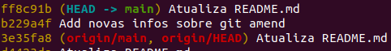

    * Podemos modificar a mensagem do último _commit_ `ff8c91b` -> `$ git commit --amend -m "Atualiza README.md com exemplo de git amend"`
  
    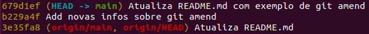  
    
    * Executando novamente `$ git log --oneline` perceba que o _commit_ `ff8c91b` foi substituído pelo `6791def` com a nova mensagem.

* `git commit --amend`: realiza a mesma função já descrita acima, porém como não estamos passando a _flag_ `-m`, é aberto o editor configurado como _default_ para definirmos a mensagem do _commit_;

* `git commit --amend --no-edit`: caso tivéssemos algum arquino na área de _staging_ e gostaríamos que ele tivesse sido commitado no _commit_ anterior, podemos utilizar essa variação do comando para cumprir esse propósito sem editar a mensagem do _commit_;

* `git branch`: lista os _branches_ existentes no repositório;

* `git branch -r`: lista os _branches_ presentes no repositório remoto;

* `git branch -a`: lista todos os _branches_, remotos e locais;

* `git branch -d <nome-da-branch>`: deleta o _branch_ especificado;

* `git branch -m <novo-nome>`: renomeia o _branch_ atual com o nome especificado;

* `git remote -v`: lista as referências para repositórios remotos e respectivas urls presentes no seu repositório local.  
  Considerando que o comando acima foi executado, na imagem abaixo é mostrada uma referência chamada **origin** para um repositório remoto:

  

* `git remote add <nome-repositorio-remoto> <url>`: associa seu repositório local a um remoto, cujo `nome-repositorio-remoto` é de sua escolha:
  * Ex.: `$ git remote add origin https://github.com/rochards/new-project.git`. Por convenção, chamamos nossa referência para o repositório remoto de **origin**.

* `git remote rename <nome-atual> <novo-nome>`: comando para renomear o nome da referência para o repositório remoto:
  * Ex. `$ git remote rename origin origin-git`

* `git remote remove <nome-repositorio-remoto>`: exclui a referência, que existe na sua máquina, para o repositório remoto:
  * Ex. `$ git remote remove origin`

* `git checkout -b <nome-novo-branch>`: cria um novo _branch_ e já o seleciona como o atual:
  * Ex. `$ git checkout -b fix-bug` 

* `git checkout -b <nome-novo-branch> origin/<branch-remoto>`: fcria um novo _branch_ local a partir do remoto. Posteriomente, as modificações realizadas localmente podem ser enviadas para o _branch_ remoto de origem.

* `git checkout <hash-commit>`: visualiza as alterações do projeto até o _commit_ indicado. Esse comando é muito útil para você "andar" pelo histórico de modificações. O comando é seguro, pois não alterará o estado atual do seu projeto:
  * Ex.: `$ git checkout 9e101fd`. Supondo que antes do _checkout_ estávamos no _branch_ `develop`, caso queira voltar ao estado atual do _branch_ basta executar `git checkout develop`.

* `git fetch`: baixa arquivos, commits e referências de um repositório remoto. Por padrão as buscas são feitas em **origin**. Esse comando é seguro, porque nada será alterado em seus *branchs* locais;
  * Ex1.
    * Você gostaria de verificar se houveram modificações no *branch* remoto e antes de fazer o _merge_ gostaria de olhar as alterações -> `$ git fetch`
    
    
    
    * Algumas *features* foram adicionadas no repositório remoto e podemos confirmar -> `$ git status`
    
    
    
    * Podemos verificar a diferença entre o repositório local e o remoto utilizando os dois *hashs* apresentados na figura anterior -> `$ git diff d99196f..d98661f`
    
    
    
    * Agora, para trazer as alterações para nosso repositório local basta executar um *merge* com o *hash* do *commit* remoto -> `$ git merge d98661f`
    
    
  
  * **Obs.:** fazendo um `$ git pull` o *fetch* e *merge* são feitos automaticamente.

* `git fetch <remote> <nome-do-branch>`: busca apenas as alterações no _branch_ especificado do repositório remoto;

* `git pull`: busca e baixa conteúdos do repositório remoto e realiza atualizações imediatas no repositório local. Esse comando é a combinação do `git fetch` e `git merge`.

* `git push  <remoto> <local-branch>`: envia para o repositório remoto as alterações do _branch_ local.
  * Ex1: `git push origin main`
  
  :bulb: inserir a _flag_ `-u` ao comando acima fará com que o seu _branch_ local monitore e evolução do _branch_ remoto, conforme mostra o exemplo da figura abaixo

  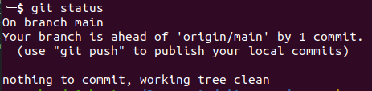

* `git revert HEAD`: desfaz as alterações do último _commit_. O Git adiciona um novo _commit_ que desfaz todas as alterações do commit anterior:
  * Ex1: 
    * Verifiquemos os _commit_ existentes com `$ git log --oneline`
    
    
    
    * Executando `$ git revert HEAD`
    
    
  
  * Ex2: `git revert HEAD~1` reverteria as modificações do primeiro _commit_ anterior à HEAD;
  * Ex3: `git revert HEAD~2` reverteria as modificações do segundo _commit_ anterior à HEAD e assim por diante.
  
  **Obs**.: reverter modificações anteriores à HEAD pode requerer uma ação manual para resolver conflitos.

  :bulb: essa abordagem é a mais indicada para reverter _commits_ que já foram publicados em um repositório remoto.

* `git revert --abort`: cancela tentativa de reverter o _commit_. Pode ser utilizado quando o comando de _git revert_ resultou em conflitos.

* `git clean`: remove arquivos não monitorados pelo Git.  
  Para os exemplos abaixo, vamos considerar que temos um arquivo não monitorado chamado `excluir.js`:
  * Ex1: `$ git clean -n` exibe os arquivos a serem excluídos
    
    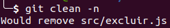
  
  * Ex2: `$ git clean -i` apresenta um _menu_ interativo e te dá opções do que fazer com cada arquivo
    
    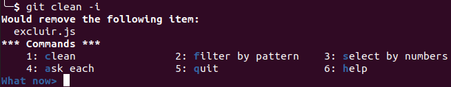
  
  * Ex3: `$ git clean -f` apaga todos os arquivos não monitorados
    
    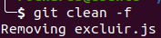
  
  **Obs.:** junto as _flags_ acima utilize `-d` para que a busca aconteça de forma recursiva, ou seja, arquivos que estão dentro de outros diretórios, como `src/files/tests/excluir.js`.

  * Ex4: `$ git clean -di` 
  
* `git rm <arquivo>`: remove arquivos que já estão sendo monitorados pelo git.
  * Ex: `$ git rm index.js` exclui o arquivo em questão  
  **Obs.:** se o arquivo estiver na área de _stage_ será necessário utilizar a _flag_ `-f` para forçar a exclusão

* `git merge <nome-branch>`: mescla as modificações de dois _branchs_:
  * Ex1:
    * Estamos no _branch_ `main` e temos por enquanto apenas os _commits_

    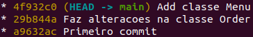

    * Criamos um _branch_ chamado `feature-1` e fizemos alguas modificações nele

    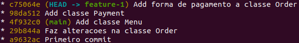

    * Mudamos para o _branch_ `main` e executamos -> `$ git merge feature-1`

    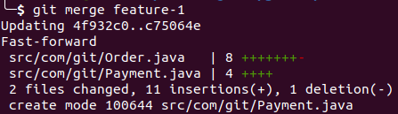

    * Perceba na terceira linha da figura acima que foi feito um _Fast-forward_, isso aconteceu porque enquanto eram feitas modificações em `feature-1` o _branch_ `main` não foi alterado. Como resultado, abaixo podemos ver como está o _branch_ `main`
    
    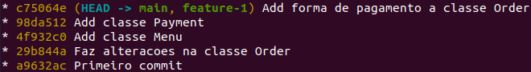 
  
  * Ex2:
    * Estamos novamente no _branch_ `main` e temos por enquanto apenas os _commits_

    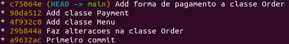

    * Criamos um _branch_ chamado `feature-2` e fizemos algumas modificações nele

    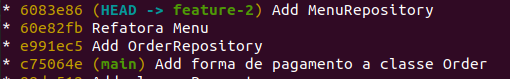

    * Antes do _merge_ em `main`, percebemos que houve modificação no histório de _commits_. Na imagem abaixo, perceba que quando comparamos às anteriores o último _commit_ em `main` não é mais o `c75064e` e sim o `d455e20`

    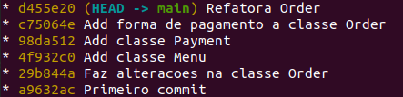

    * Mudamos para o _branch_ `main` e executamos -> `$ git merge feature-2`
    
    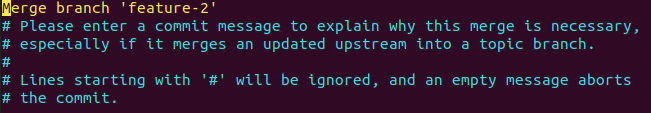  
    o editor _default_ é aberto para escrevermos uma mensagem de _commit_

    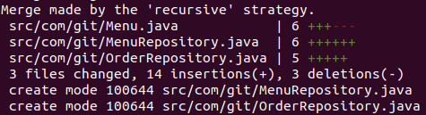 

    * Perceba na mensagem de `'recursive' strategy` apresentada na primeira linha da figura acima. Isso se dá porque os dois _branchs_ evoluíram separadamente. 
    * Quando verificamos o histórico de _commits_ no _branch_ `main` com `$ git log --oneline --graph`, temos

    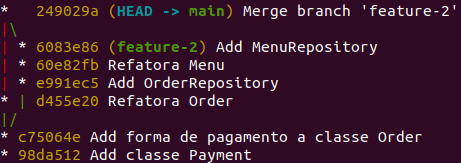

    A figura abaixo ajuda a entender melhor como aconteceu a evolução dos _branchs_. Perceba que o _commit_ de _merge_ `249029a` possui dois "pais".

    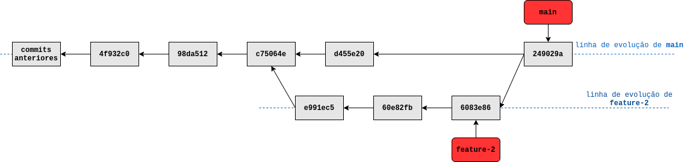

    :warning: se as mesmas linhas de um mesmo arquivo forem modificadas em _branchs_ diferentes, você terá um conflito de _merge_

### Referências
[1] - https://www.atlassian.com/git/tutorials/learn-git-with-bitbucket-cloud  
[2] - https://git-scm.com/book/en/v2
