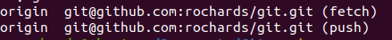

# Comandos de Git

### Controle de versionamento
Sistemas de Controle de Versionamento, em inglês *Version Control System* (VCS), são ferramentas que auxiliam o time de desenvolvimento a gerenciar mudanças no código ao longo do tempo. [1]

### GIT
**Git**, em suma, é um Sistema Distribuído de Controle de Versionamento, ou *Distributed VCS* (DVCS), uma vez que todo o conteúdo de um repositório remoto é completamente copiado para a máquina de cada contribuidor/desenvolvedor. [1]
O projeto é *open source* e foi desenvolvido originalmente em 2005 por Linus Torvalds, o famoso criado do kernel do Linux. [2]

Antes de começarmos, aprenda a instalar o [Git](https://www.atlassian.com/br/git/tutorials/install-git) de acordo com seu Sistema Operacional.

### Principais comandos

Os comandos serão executados em algum terminal. Caso esteja em um sistema operacional Windows, recomendo a utilização do **Git Bash**.

* `git init`: inicializa um novo repositório Git em sua máquina.
  * Ex. Se executamos `$ git init` em **Documentos/my-project**, então **my-project** agora é um repositório git. 

* `git clone <url-repositorio>`: clona um repositório:
  * Ex. `$ git clone https://github.com/freeCodeCamp/freeCodeCamp.git`

* `git status`: verifica o status do repositório:
  * Ex. `$ git status`  
  

* `git add <nome-arquivo>`: adiciona o arquivo especificado:
  * Ex. `$ git add README.md`

* `git add .`: adiciona todos os arquivos a partir do diretório atual.  
  Considere os diretórios abaixo e que todos os arquivos foram alterados  
  
  * Ex1. Se estamos em **Git**, `$ git add .` então adiciona todos os arquivos;
  * Ex2. Se estamos em **Git/src**, `$ git add .` então só adiciona _**index.css**_ e _**index.css**_

* `git commit -m "sua mensagem"`: comita as mudanças no repositório, antes adicionadas por um `git add`, com uma mensagem.  
  Considerando que modificamos um arquivo **README.md** e já fizemos `git add README.md`. Quando executamos um `git status` é mostrado que o arquivo em questão está pronto para ser comitado
  
  * Ex. `git commit -m "Atualiza README.md"`

* `git commit -m "Titulo do commit" -m "Mais detathes do commit"`: uma variação do comando para você detalhar melhor suas alterações. Você pode inserir quantos `-m` desejar, ao final cada mensagem aparecerá em um parágrafo diferente;

* `git commit`: executado dessa forma o Git abre um editor de texto para nos dar mais liberdade ao escrever nossos commits. Você pode saber mais procurando na [documentação](https://git-scm.com/book/en/v2/Customizing-Git-Git-Configuration) por _core.editor_;

* `git commit -v`: permite que você veja, no editor de texto _default_, as mudanças que serão adicionadas neste commit.
  * Considere que executamos um `$ git add .` para adicionar as modificações no arquivo **README.md** e em seguida `$ git commit -v`. A figura abaixo mostra o resultado no editor _default_:
  
* `git branch`: lista as _branches_ existentes no repositório;

* `git branch -r`: lista as _branches_ presentes no repositório remoto;

* `git branch -a`: lista todas _branches_, remotas e locais;

* `git branch -d <nome-da-branch>`: deleta a _branch_ especificada;

* `git remote -v`: lista as referências para repositórios remotos e respectivas urls presentes no seu repositório local.  
  Considerando que o comando acima foi executado, na imagem abaixo é mostrada uma referência chamada **origin** para um repositório remoto:  
  

* `git remote add <nome-repositorio-remoto> <url>`: associa seu repositório local a um remoto, cujo `nome-repositorio-remoto` é de sua escolha:
  * Ex.: `$ git remote add origin https://github.com/rochards/new-project.git`. Por convenção, chamamos nossa referência para o repositório remoto de **origin**.

* `git remote rename <nome-atual> <novo-nome>`: comando para renomear o nome da referência para o repositório remoto:
  * Ex. `$ git remote rename origin origin-git`

* `git remote remove <nome-repositorio-remoto>`: exclui a referência, que existe na sua máquina, para o repositório remoto:
  * Ex. `$ git remote remove origin`

* `git checkout -b <nome-nova-branch>`: 

* `git fetch`: baixa arquivos, commits e referências de um repositório remoto. Por padrão as buscas são feitas em **origin**;

### Referências
[1] - https://www.atlassian.com/git/tutorials/what-is-version-control \
[2] - https://www.atlassian.com/git/tutorials/what-is-git
